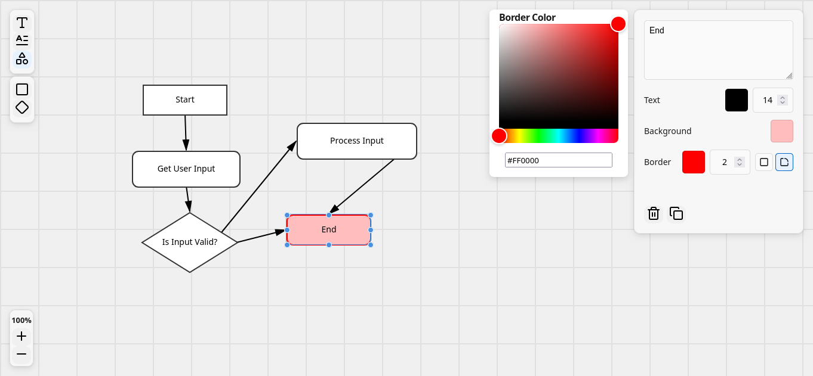

# Flowchart Maker
[](https://skillicons.dev)

A web-based flowchart editor built with Vite, React, and TypeScript. Users can create, manipulate, style, and connect nodes on an interactive canvas.

## Snapshot


## Project Status

The core canvas features are implemented: dragging, resizing, text editing, panning, zooming, and rendering nodes and edges from mock data. Styling tools for nodes are functional.
**Creation and deletion of nodes and edges are not yet implemented**. Additional toolbar actions are present as placeholders for upcoming features. Rectangle and diamond node shapes are currently supported. 

## Features

### Core Functionality

* **Node Creation and Manipulation**
  * Drag and resize nodes
  * Edit node content by double-clicking
  * Select nodes to apply styling
* **Canvas Interaction**
  * Pan by dragging the background
  * Zoom using the scroll wheel or on-screen controls
* **Edges**
  * Connect nodes with directed edges
  * Edges automatically update when nodes move
  * Optional labels for edges

### Styling

* Background color
* Border color and width
* Border radius
* Text color, font size, and font weight
* Supports rectangle and diamond shapes

## Technologies Used

* React
* TypeScript
* Vite
* Zustand for state management
* Lucide React for SVG icons
* React Colorful for color-picker

## To do

* Additional shapes (circles, ellipses, parallelograms)
* Creating and deleting nodes and edges via the toolbar
* Undo/redo system
* Node grouping
* Orthogonal edge routing (Manhattan routing)

## Install

```bash
# using npm
git clone <repo-url>
cd <repo-name>
npm install
npm run dev
```
